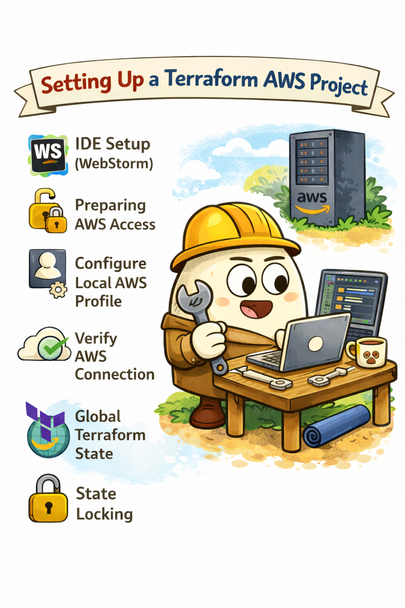

# Development Setup

<p align="center">
  
</p>

Before working with the Terraform infrastructure in this repository, several initial steps are required.

These steps ensure a consistent development environment and secure access to AWS resources.

---

## IDE Setup (WebStorm)

If you are using **WebStorm**, it is recommended to configure automatic formatting for Terraform files.

### Install Terraform plugin

Install the official **Terraform plugin** in WebStorm to enable syntax highlighting and validation.

Steps:

- Open **Settings**
- Navigate to **Plugins**
- Search for **Terraform**
- Install the plugin

### Configure Terraform formatting watcher

To automatically format Terraform files, configure a **File Watcher**.

Steps:

1. Go to  
   `Settings → Tools → File Watchers`

2. Create a new watcher

3. Configure it as follows:

- **Name:** `terraform fmt`
- **Program:** `terraform`
- **Arguments:** `fmt`
- **File type:** Terraform

This ensures that Terraform files are automatically formatted on save.

---

## Preparing AWS Access

Before running Terraform, we need to create a dedicated **AWS IAM user** that will be used to manage infrastructure.

Using a separate user is important for several reasons:

1. **Security** - the root account should never be used for infrastructure management.
2. **Auditability** - changes can be tracked per user.
3. **Access control** - permissions can be limited or revoked when needed.

### Creating the IAM user

Steps:

1. Open **AWS Console**
2. Navigate to **IAM**
3. Go to **Users**
4. Click **Create User**

Then:

- Enable **programmatic access**
- Attach permissions

For initial setup you may attach:

```shell
AdministratorAccess
```

In production environments it is recommended to replace this with a **restricted policy**.

After creating the user:

- Generate **Access Key**
- Generate **Secret Access Key**
- Copy the **User ARN**

---

## Configure Local AWS Profile

Once credentials are created, configure a local AWS profile.

Run:

```bash
aws configure
```

```bash
AWS Access Key ID [None]: AKIA...
AWS Secret Access Key [None]: xxxxxxxxx
Default region name [None]: eu-central-1
Default output format [None]: json
```

After that, configuration files will appear:

```shell
~/.aws/credentials
~/.aws/config
```

You can verify the configuration:

```shell
aws sts get-caller-identity
```

## Global Terraform State

In a team environment, Terraform state must not be stored locally.

If multiple engineers work on the infrastructure, local state can easily lead to inconsistencies and broken deployments.

Instead, Terraform state should be stored in a remote backend.

The most common solution in AWS environments is an S3 bucket for storing Terraform state.

This allows all team members to work with the same infrastructure state.

## State Locking

When multiple engineers work with Terraform, there is a risk that two people might run terraform apply at the same time.

This can corrupt the infrastructure state and cause unpredictable results.

To prevent this, Terraform supports state locking.

In AWS environments, this is typically implemented using:

- **S3** - for storing state
- **DynamoDB** - for state locking

State locking ensures that only one Terraform operation can run at a time.

## Bootstrap Infrastructure

Because the Terraform backend itself requires infrastructure (S3 bucket and DynamoDB table), it is common to create a
small bootstrap Terraform project.

This bootstrap configuration is responsible for:

- creating the S3 bucket for Terraform state
- creating the DynamoDB table for state locking
- preparing the initial infrastructure required for the main Terraform project

Once the bootstrap infrastructure is created, the main Terraform project can safely use the remote backend.
